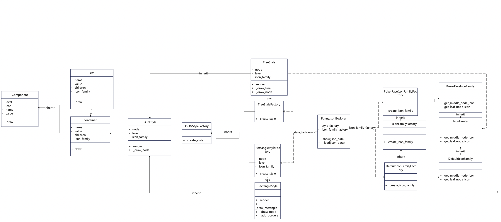

### FunnyJsonExplorer设计文档

#### 1.类图



#### 2.设计模式

本项目代码在实现的过程中，将工厂方法，抽象工厂，建造者模式和组合模式均有运用，接下来将结合类图和代码进行讲解。

##### 2.1 工厂方法

作用：工厂方法可以延迟实例化到子类，只创建接口，但具体由子类进行实现，这使得代码之间的耦合度降低，方便工作者进行拓展和补充。

代码体现：

JsonStyleFactory -> TreeStyleFactory, RectangleFactory

- JsonStyleFactory：创建 `create_style()`抽象方法。
- TreeStyleFactory与RectangleStyleFactory具体实现 `create_style()`。

```python
class JSONStyleFactory(ABC):
    @abstractmethod
    def create_style(self) -> JSONStyle:
        pass

class TreeStyleFactory(JSONStyleFactory):
    def create_style(self) -> JSONStyle:
        return TreeStyle()

class RectangleStyleFactory(JSONStyleFactory):
    def create_style(self) -> JSONStyle:
        return RectangleStyle()
```

IconFamilyFactory -> PokerFaceIconFamilyFactory, DefaultIconFamilyFactory

- IconFamilyFactory: 创建 `create_icon_family()`抽象方法
- PokerFaceIconFamilyFactory与DefaultIconFamilyFactory具体实现 `create_icon_family()`。

```python
class IconFamilyFactory(ABC):
    @abstractmethod
    def create_icon_family(self) -> IconFamily:
        pass

class PokerFaceIconFamilyFactory(IconFamilyFactory):
    def create_icon_family(self) -> IconFamily:
        return PokerFaceIconFamily()

class DefaultIconFamilyFactory(IconFamilyFactory):
    def create_icon_family(self) -> IconFamily:
        return DefaultIconFamily()
```

##### 2.2 抽象工厂方法

作用：抽象工厂模式提供一个创建一系列相关或相互依赖对象的接口，而无需指定它们的具体类。这使得客户端可以通过抽象接口来操作具体对象，而不需要了解它们的具体实现。这也增加了代码的可拓展性，增加新的产品族时，只需添加新的具体工厂和具体产品，而不需要修改现有工厂和产品的代码，符合开放/封闭原则。

JsonStyle -> TreeStyle，RectangleStyle

- JsonStyle创建 `render()`,`_draw_node()`等工厂方法
- TreeStyle与RectangleStyle具体实现
- 具体代码可以在项目仓库中查看。

```python
class JSONStyle(ABC):
    @abstractmethod
    def render(self, data, icon_family):
        pass
  
    def _draw_node(self, node, level, icon_family, is_last, is_first_level):
        pass

class TreeStyle(JSONStyle):
    def render(self, data, icon_family):

    def _draw_tree(self, node, level, icon_family, is_last, is_first_level):

    def _draw_node(self, node, level, icon_family, is_last, is_first_level):

class RectangleStyle(JSONStyle):
    def render(self, data, icon_family):

    def _draw_rectangle(self, node, level, icon_family, is_last):

    def _draw_node(self, node, level, icon_family, is_last, lines):

    def _add_borders(self, lines, width):

```

IconFamily -> PokerFaceIconFamily，DefaultIconFamily

- IconFamily创建 `get_middle_node_icon()`,`get_leaf_node_icon()`等工厂方法
- PokerFaceIconFamily与DefaultIconFamily具体实现
- 具体代码可以在项目仓库中查看。

```python
class IconFamily(ABC):
    @abstractmethod
    def get_middle_node_icon(self):
        pass

    @abstractmethod
    def get_leaf_node_icon(self):
        pass

class PokerFaceIconFamily(IconFamily):
    def get_middle_node_icon(self):
        return "♢"

    def get_leaf_node_icon(self):
        return "♤"
  
class DefaultIconFamily(IconFamily):
    def get_middle_node_icon(self):
        return ""

    def get_leaf_node_icon(self):
        return ""
```

##### 2.3 建造者模式

作用：

* **分离复杂对象的构建和表示** ：建造者模式将一个复杂对象的构建过程分离出来，使得同样的构建过程可以创建不同的表示。
* **简化对象创建** ：通过将复杂对象的构建步骤封装在建造者中，客户端无需了解构建的细节，只需通过指挥者调用建造者来获得所需对象。
* **提高代码的可读性和可维护性** ：将对象的构建步骤明确分离出来，使代码更易于理解和维护，同时也便于对象的扩展和修改。

```python
# 选择样式工厂
    if args.style == 'tree':
        style_factory = TreeStyleFactory()
    elif args.style == 'rectangle':
        style_factory = RectangleStyleFactory()

    # 选择图标族工厂
    if args.icon == 'poker':
        icon_family_factory = PokerFaceIconFamilyFactory()
    elif args.icon == 'default':
        icon_family_factory = DefaultIconFamilyFactory()

    # 读取JSON文件
    with open(args.file, 'r') as file:
        json_data = file.read()

    # 构建FunnyJsonExplorer
    explorer = FunnyJsonExplorer(style_factory, icon_family_factory)
```

定义细分组件 `style_factory`与 `icon_family`用他们组成我需要的 `FunnyJsonExplorer`。将不同层级的类之间解耦，使得代码层次结构更加清晰的同时也能够方便进行拓展。

##### 2.4 组合模式

作用：

* **统一对待单个对象和组合对象** ：组合模式将对象组合成树形结构以表示“部分-整体”的层次结构。使得客户端可以统一地对待单个对象和组合对象，简化客户端代码。
* **简化复杂对象的操作** ：组合模式使得客户端可以通过同一个接口操作整个对象组合，而无需关心它们的具体类型，简化了对复杂对象的操作。

```python
# Abstract Component class
class Component(ABC):
    @abstractmethod
    def draw(self, level=0, icon=''):
        pass

# Leaf class representing a JSON leaf node
class Leaf(Component):
    def __init__(self, name, value):
        self.name = name
        self.value = value

    def draw(self, level=0, icon=''):
        return f"{'  ' * level}{icon}{self.name}: {self.value}\n"

# Container class representing a JSON container (composite node)
class Container(Component):
    def __init__(self, name, icon=''):
        self.name = name
        self.icon = icon
        self.children = []

    def add(self, component: Component):
        self.children.append(component)

    def draw(self, level=0, icon=''):
        result = f"{'  ' * level}{icon}{self.name}\n"
        for child in self.children:
            result += child.draw(level + 1, icon)
        return result
```

主要关注 `Leaf`类与 `Container`类，在 `Contain`类中有属性 `children`，用于存储分支节点，因此会存储自身以及 `Leaf`叶子结点，实现了组合模式。
